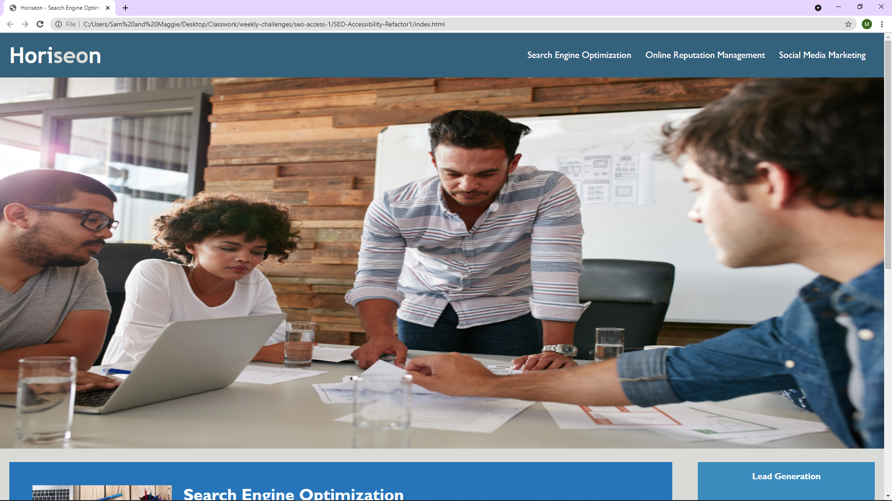
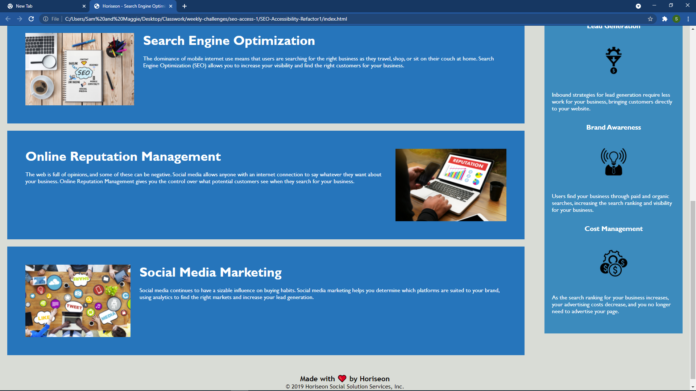

# SEO-Accessibility-Refactor1
Weekly challenge 1 in bootcamp - refactoring given code for enhanced SEO and user accessibility

## Motivation, What I Did, and What I Learned
I am attempting to learn and become more familiar with basic html, css, and git commands. With the given code base, I attempted to improve the SEO of the web page. I also added semantic element tags instead of div tags, in most cases. This was done in order to improve the readability of the code, and make it more easy to work with. Comments were added to the html and css files. User accessibility was improved by adding alt tags to each of the images. The css code was consolidated in order to simplify it and make it easier to work with. During my work on this project, I was able to more familiarize myself with the way these languages work in actual business practice. Though the tasks were simple, for me they were a challenge, and have allowed me to learn and grow my web development skills.

## Links
Below I will link the deployed page of my finished code and a screenshot of how it appears in the browser.

 

https://steadysamwise4.github.io/SEO-Accessibility-Refactor1/

